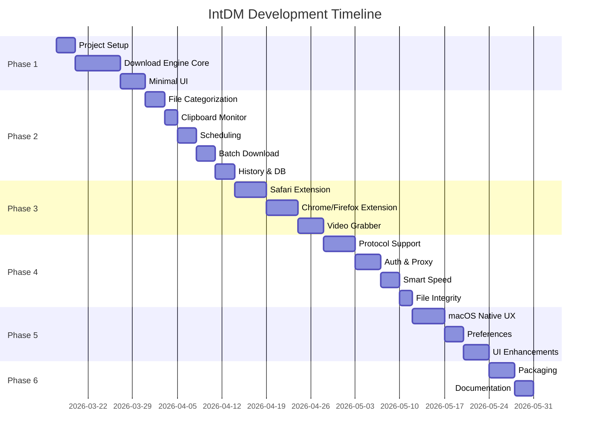

# 🚀 International Download Manager for macOS — Roadmap

> A macOS native download manager inspired by **Internet Download Manager (IDM)** for Windows.
> Built with **Swift + SwiftUI**, targeting **macOS 14 (Sonoma)+**.
> **Open Source** — MIT License

---

## 📌 Vision

IDM adalah download manager paling powerful di Windows — multi-connection downloading, browser integration, scheduling, resume capability, dan banyak lagi. Sayangnya, tidak ada versi macOS-nya. Proyek ini bertujuan membuat **aplikasi macOS native** yang membawa semua kekuatan IDM ke ekosistem Apple.

**Nama Proyek:** International Download Manager (IntDM)
**License:** MIT (Open Source)
**Min Target:** macOS 14 Sonoma+
**Repository:** Public on GitHub

---

## 🏗️ Tech Stack

| Layer | Technology | Alasan |
|-------|-----------|--------|
| **Language** | Swift 5.9+ | Native performance, first-class macOS support |
| **UI Framework** | SwiftUI + AppKit (hybrid) | Modern declarative UI + native macOS controls |
| **Networking** | URLSession + NIO (optional) | Multi-connection segmented download |
| **Database** | SwiftData / SQLite | Persistent download history & queue |
| **Browser Extension** | Native Messaging + WebExtension API | Chrome/Firefox/Safari integration |
| **Build System** | Xcode + Swift Package Manager | Standard Apple toolchain |
| **Distribution** | DMG / Homebrew Cask / (future) Mac App Store | Easy installation |

---

## 🗺️ Roadmap Phases

### Phase 1: Foundation & Core Engine ✅
**Target: Sprint 1–2 (Completed)**

Membangun pondasi aplikasi dan download engine inti.

#### 1.1 Project Setup
- [x] Inisialisasi Xcode project (macOS App, SwiftUI lifecycle)
- [x] Setup Swift Package Manager dependencies
- [x] Konfigurasi `.gitignore` untuk Xcode/Swift
- [x] Setup code signing & entitlements (network, file access)
- [x] Arsitektur dasar: MVVM + Protocol-Oriented Design

#### 1.2 Download Engine Core
- [x] **Single-threaded download** — basic `URLSession` download task
- [x] **Multi-connection download (segmented)** — split file ke 8 segments (default)
  - HTTP Range header support (`Range: bytes=X-Y`)
  - Segment manager: track progress per segment
  - Merger: Direct concurrent writes using `FileWriter` actor
- [x] **Resume/Pause** — foundation laid (Range support)
- [ ] **Download queue** — FIFO queue (Planned)
- [ ] **Speed limiter** — throttle bandwidth (Planned)
- [x] **Error handling & auto-retry** — basic error logging

#### 1.3 Minimal UI (SwiftUI)
- [x] Main window dengan download list (table view)
- [x] "Add Download" dialog — input URL, pilih save location
- [x] Progress bar per download (dynamic color: blue -> green)
- [x] Basic toolbar: Add, Pause
- [x] Status bar: total size, status label

---

### Phase 2: Essential Features ⚙️
**Target: Sprint 3–4 (2 minggu)**

Fitur-fitur yang membuat IDM sangat berguna sehari-hari.

#### 2.1 Smart File Categorization
- [ ] Auto-detect file type dari URL/MIME type
- [ ] Kategori: Documents, Videos, Music, Programs, Compressed, Others
- [ ] Auto-set download folder berdasarkan kategori
- [ ] Sidebar navigation by category

#### 2.2 Clipboard Monitoring
- [ ] Monitor clipboard untuk URL yang di-copy
- [ ] Auto-popup "Add Download" dialog saat URL terdeteksi
- [ ] Configurable: whitelist/blacklist file extensions
- [ ] Toggle on/off dari menu bar

#### 2.3 Download Scheduling
- [ ] Schedule download pada waktu tertentu
- [ ] Recurring schedule (daily, specific days)
- [ ] Action setelah selesai: shutdown, sleep, close app, run script
- [ ] Queue priority system (high, normal, low)

#### 2.4 Batch Download
- [ ] Download multiple URLs sekaligus (paste list)
- [ ] Import URL list dari text file
- [ ] Wildcard URL support (e.g., `image_[001-100].jpg`)
- [ ] Batch download dari halaman web (grab semua links)

#### 2.5 History & Database
- [ ] Persistent download history (SwiftData/SQLite)
- [ ] Search & filter history
- [ ] Re-download dari history
- [ ] Export/import download list

---

### Phase 3: Browser Integration 🌐
**Target: Sprint 5–6 (2 minggu)**

Integrasi dengan browser — fitur killer IDM.

#### 3.1 Safari Extension
- [ ] Safari Web Extension (native Swift + JS)
- [ ] Intercept download links di browser
- [ ] "Download with IntDM" context menu
- [ ] Auto-capture video/audio stream URLs
- [ ] File size detection sebelum download

#### 3.2 Chrome/Firefox Extension
- [ ] WebExtension (manifest v3) untuk Chrome & Firefox
- [ ] Native Messaging Host untuk komunikasi extension ↔ app
- [ ] Intercept download events (`chrome.downloads` API)
- [ ] Context menu integration
- [ ] Popup UI untuk quick add download

#### 3.3 Video Grabber
- [ ] Detect video streams dari browser (HLS/DASH/MP4)
- [ ] Panel floating yang menampilkan detected videos
- [ ] Pilih quality/resolution sebelum download
- [ ] Support: YouTube*, Vimeo, Twitter/X, Instagram, dll.

> *YouTube support subject to Terms of Service compliance

---

### Phase 4: Advanced Features 🔥
**Target: Sprint 7–8 (2 minggu)**

Fitur-fitur advanced yang membedakan dari download manager biasa.

#### 4.1 Protocol Support
- [ ] HTTP/HTTPS (sudah dari Phase 1)
- [ ] FTP/FTPS support
- [ ] SFTP support
- [ ] Magnet links / BitTorrent (via libTorrent)
- [ ] Custom protocol handlers

#### 4.2 Authentication & Proxy
- [ ] HTTP Basic/Digest authentication
- [ ] Cookie-based authentication (import dari browser)
- [ ] Proxy support: HTTP, SOCKS4, SOCKS5
- [ ] Per-site proxy configuration
- [ ] macOS Keychain integration untuk credentials

#### 4.3 Smart Speed & Connection Management
- [ ] Dynamic segment allocation — lebih banyak segments untuk koneksi cepat
- [ ] Adaptive speed: auto-adjust berdasarkan network condition
- [ ] Connection reuse & keep-alive
- [ ] Mirror support — download dari multiple servers
- [ ] Speed graph real-time per download

#### 4.4 File Integrity
- [ ] Checksum verification (MD5, SHA-1, SHA-256)
- [ ] Auto-verify setelah download selesai
- [ ] Virus scan integration (macOS XProtect / custom)

---

### Phase 5: Polish & UX 💎
**Target: Sprint 9–10 (2 minggu)**

Membuat aplikasi terasa premium dan native macOS.

#### 5.1 macOS Native Experience
- [ ] Menu bar icon dengan dropdown (quick status & controls)
- [ ] Dock icon badge (active downloads count)
- [ ] macOS Notifications (download complete, error, etc.)
- [ ] Drag & drop URL ke dock icon untuk download
- [ ] Touch Bar support (jika applicable)
- [ ] Keyboard shortcuts untuk semua aksi utama
- [ ] Dark mode & light mode (automatic)

#### 5.2 Preferences & Settings
- [ ] General: startup, default save location, connections per download
- [ ] Network: speed limit, proxy, timeout settings
- [ ] File types: associations, auto-categorization rules
- [ ] Notifications: customizable alerts
- [ ] Advanced: thread count, buffer size, disk cache

#### 5.3 UI Enhancements
- [ ] Drag & drop reorder downloads
- [ ] Column customization di download list
- [ ] Detail panel: per-segment progress, connection info, headers
- [ ] Theming support (accent colors)
- [ ] Localization: English + Bahasa Indonesia

---

### Phase 6: Distribution & Ecosystem 📦
**Target: Sprint 11–12 (2 minggu)**

Persiapan release dan distribusi.

#### 6.1 Packaging & Distribution
- [ ] Code signing dengan Apple Developer ID
- [ ] Notarization untuk distribusi di luar App Store
- [ ] DMG installer dengan custom background
- [ ] Homebrew Cask formula
- [ ] Auto-update mechanism (Sparkle framework)
- [ ] Crash reporting (Sentry / custom)

#### 6.2 Open Source & Community
- [ ] MIT License file
- [ ] CONTRIBUTING.md — contribution guide
- [ ] CODE_OF_CONDUCT.md
- [ ] Issue templates (bug report, feature request)
- [ ] PR templates
- [ ] GitHub Actions CI/CD (build + test)
- [ ] GitHub Releases with automated changelog

#### 6.3 Documentation
- [ ] User guide / help documentation
- [ ] Website / landing page (GitHub Pages)
- [ ] API documentation untuk extensions

#### 6.4 Future Ideas (Backlog) 🔮
- [ ] iCloud sync untuk download queue & history
- [ ] Shortcuts.app integration
- [ ] URL scheme handler (`intdm://`)
- [ ] Widget untuk macOS desktop/notification center
- [ ] Remote download via iPhone companion app
- [ ] AI-powered download organization
- [ ] Plugin system untuk extensibility

---

## 📊 Priority Matrix

```
                    HIGH IMPACT
                        │
          ┌─────────────┼─────────────┐
          │   Phase 1    │   Phase 3   │
          │  Core Engine │  Browser    │
          │  (MUST HAVE) │  Integration│
LOW ──────┼─────────────┼─────────────┼────── HIGH
EFFORT    │   Phase 2    │   Phase 4   │     EFFORT
          │  Essential   │  Advanced   │
          │  Features    │  Features   │
          └─────────────┼─────────────┘
                        │
                    LOW IMPACT
```

**Prioritas Development:**
1. 🔴 **P0 (Critical):** Phase 1 — tanpa ini, app tidak bisa jalan
2. 🟠 **P1 (High):** Phase 2 & 3 — fitur yang membuat app useful
3. 🟡 **P2 (Medium):** Phase 4 & 5 — fitur differentiator & polish
4. 🟢 **P3 (Low):** Phase 6 — distribution & ecosystem

---

## 🎯 MVP Definition (Minimum Viable Product)

MVP = **Phase 1 + Phase 2 (partial)**

Sebuah download manager yang bisa:
1. ✅ Download file dengan multi-connection (segmented)
2. ✅ Pause/Resume download
3. ✅ Download queue
4. ✅ Clipboard monitoring
5. ✅ File categorization
6. ✅ Download history

Ini sudah cukup untuk mulai dipakai sehari-hari.

---

## 📂 Proposed Project Structure

```
international-download-manager/
├── IntDM/                          # Main macOS App
│   ├── App/
│   │   ├── IntDMApp.swift          # App entry point
│   │   └── AppDelegate.swift       # AppKit lifecycle
│   ├── Models/
│   │   ├── DownloadItem.swift      # Download data model
│   │   ├── DownloadSegment.swift   # Segment data model
│   │   └── Category.swift          # File category model
│   ├── ViewModels/
│   │   ├── DownloadListVM.swift    # Main list view model
│   │   ├── AddDownloadVM.swift     # Add download dialog VM
│   │   └── SettingsVM.swift        # Settings view model
│   ├── Views/
│   │   ├── MainWindow/
│   │   │   ├── MainView.swift
│   │   │   ├── DownloadListView.swift
│   │   │   ├── SidebarView.swift
│   │   │   └── ToolbarView.swift
│   │   ├── Dialogs/
│   │   │   ├── AddDownloadView.swift
│   │   │   └── BatchDownloadView.swift
│   │   ├── Settings/
│   │   │   └── SettingsView.swift
│   │   └── Components/
│   │       ├── ProgressBarView.swift
│   │       ├── SpeedIndicator.swift
│   │       └── SegmentMapView.swift
│   ├── Engine/
│   │   ├── DownloadEngine.swift    # Core download orchestrator
│   │   ├── SegmentManager.swift    # Multi-segment coordinator
│   │   ├── SegmentDownloader.swift # Individual segment worker
│   │   ├── FileMerger.swift        # Merge segments
│   │   ├── QueueManager.swift      # Download queue
│   │   ├── SpeedTracker.swift      # Speed calculation
│   │   └── ClipboardMonitor.swift  # Clipboard watcher
│   ├── Services/
│   │   ├── PersistenceService.swift
│   │   ├── NotificationService.swift
│   │   ├── ProxyService.swift
│   │   └── ChecksumService.swift
│   ├── Extensions/
│   │   └── ...
│   └── Resources/
│       ├── Assets.xcassets
│       └── Localizable.strings
├── IntDMExtension/                  # Browser Extensions
│   ├── Safari/
│   ├── Chrome/
│   └── Shared/
├── IntDMTests/                      # Unit Tests
├── IntDMUITests/                    # UI Tests
├── docs/                            # Documentation
│   ├── ROADMAP.md                   # ← This file
│   ├── ARCHITECTURE.md
│   └── CONTRIBUTING.md
├── Package.swift                    # SPM dependencies
└── README.md
```

---

## 🔄 Comparison: IDM vs IntDM

| Feature | IDM (Windows) | IntDM (macOS) |
|---------|:---:|:---:|
| Multi-connection download | ✅ | 🎯 Phase 1 |
| Pause/Resume | ✅ | 🎯 Phase 1 |
| Download queue | ✅ | 🎯 Phase 1 |
| Speed limiter | ✅ | 🎯 Phase 1 |
| File categorization | ✅ | 🎯 Phase 2 |
| Clipboard monitoring | ✅ | 🎯 Phase 2 |
| Scheduling | ✅ | 🎯 Phase 2 |
| Batch download | ✅ | 🎯 Phase 2 |
| Browser integration | ✅ | 🎯 Phase 3 |
| Video grabber | ✅ | 🎯 Phase 3 |
| FTP support | ✅ | 🎯 Phase 4 |
| Proxy support | ✅ | 🎯 Phase 4 |
| Site grabber | ✅ | 🔮 Backlog |
| Dark mode | ❌ | 🎯 Phase 5 |
| Native macOS experience | ❌ | 🎯 Phase 5 |
| iCloud sync | ❌ | 🔮 Backlog |
| TouchBar / Widgets | ❌ | 🔮 Backlog |

---

## 📅 Timeline Estimate



**Total estimated: ~12 minggu (3 bulan)** untuk full feature set.
**MVP: ~4 minggu (1 bulan)** untuk Phase 1 + Phase 2.

---

*Last updated: 2026-03-14*
*Version: 0.1.0-draft*
